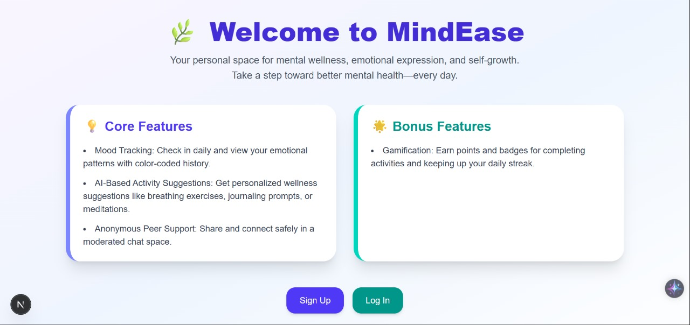

# MindEase - Capgemini Competition Entry

## Participants:
* **Tejas Choudhari**
* **Prathamesh Bhokre**

## About the Competition:
This project, MindEase, is an entry for a Capgemini competition. It showcases a comprehensive web application aimed at supporting mental wellness through various interactive features.

---

# MindEase

Welcome to MindEase, your personal space for mental wellness, emotional expression, and self-growth. Take a step toward better mental health—every day.

## Table of Contents

- [About MindEase](#about-mindease)
- [Features](#features)
  - [Core Features](#core-features)
  - [Bonus Features](#bonus-features)
- [Screenshots](#screenshots)
- [Getting Started](#getting-started)
  - [Prerequisites](#prerequisites)
  - [Installation and Running](#installation-and-running)
    - [Backend](#backend)
    - [Frontend](#frontend)
    - [Mood Detection Model](#mood-detection-model)
- [Project Repository](#project-repository)
- [Contributing](#contributing)
- [License](#license)
- [Contact](#contact)

## About MindEase

MindEase is a comprehensive web application designed to support your mental well-being journey. It offers a range of tools to help you track your mood, receive personalized wellness suggestions, connect with peers, and stay motivated through gamified elements.

## Features

### Core Features

* **Mood Tracking:** Check in daily and view your emotional patterns with a color-coded history. You can log your mood manually or use real-time mood detection via your camera.
* **AI-Based Activity Suggestions:** Get personalized wellness suggestions like breathing exercises, journaling prompts, or meditations based on your logged mood.
* **Anonymous Peer Support:** Share and connect safely in a moderated chat space with other MindEase users.

### Bonus Features

* **Gamification:** Earn points and badges for completing activities and keeping up your daily streak, encouraging consistent engagement with your mental wellness.
* **Streak Tracking:** Maintain a daily streak to foster consistency in your mood tracking and self-care routine.

## Screenshots

Here are some glimpses of the MindEase application:

| Landing Page | Create Account | Login Page |
| :--- | :--- | :--- |
|  |  |  |

| Mood Logging & Suggestions | Real-Time Mood Detection | User Profile & Activity Log |
| :--- | :--- | :--- |
|  |  |  |

| MindEase Chat |
| :--- |
|  |

## Getting Started

Follow these instructions to set up and run the MindEase project on your local machine.

### Prerequisites

Make sure you have the following installed:

* Node.js (for frontend and backend)
* npm (Node Package Manager, comes with Node.js)
* Python 3 (for the mood detection model)
* pip (Python Package Installer, comes with Python 3)

### Installation and Running

You will need to run the backend, frontend, and the mood detection model separately.

#### Backend

1.  Navigate to the `backend` directory:
    ```bash
    cd backend
    ```
2.  Install the necessary Node.js packages:
    ```bash
    npm install
    ```
3.  Start the backend server:
    ```bash
    node index.js
    ```
    The backend server will typically run on `http://localhost:3000` (or a similar port, check your `index.js` for the exact port).

#### Frontend

1.  Navigate to the `frontend` directory:
    ```bash
    cd frontend
    ```
2.  Install the necessary Node.js packages:
    ```bash
    npm install
    ```
3.  Start the frontend development server:
    ```bash
    npm run dev
    ```
    The frontend application will usually be accessible at `http://localhost:5173` (or a similar port).

#### Mood Detection Model

1.  Ensure you have Python installed.
2.  Install the required Python libraries for the mood detection model:
    ```bash
    pip install flask flask-cors tensorflow opencv-python
    ```
3.  Run the Python script for the mood detection model. This script should be located in your project's root or a designated `model` directory. Adjust the path if necessary.
    ```bash
    python emotions.py
    ```
    This will start a Flask server for your mood detection model, usually on `http://localhost:5000`.

**Note:** Ensure all three components (backend, frontend, and model) are running concurrently for the full functionality of the application.

## Project Repository

You can find the complete source code for MindEase on GitHub:
[https://github.com/prathaya135/MindEase](https://github.com/prathaya135/MindEase)

## Contributing

We welcome contributions to MindEase! If you have suggestions for improvements or new features, please feel free to:

1.  Fork the repository.
2.  Create a new branch (`git checkout -b feature/AmazingFeature`).
3.  Make your changes.
4.  Commit your changes (`git commit -m 'Add some AmazingFeature'`).
5.  Push to the branch (`git push origin feature/AmazingFeature`).
6.  Open a Pull Request.

## License

(You can add your desired license here, e.g., MIT, Apache 2.0, etc.)
For open-source projects, the [MIT License](https://opensource.org/licenses/MIT) is a common and flexible choice. You would typically create a `LICENSE` file in your repository with the full license text.

## Contact

## Contact

- [Tejas Choudhari](https://github.com/tejashcoudhari25)
- [Prathamesh Bhokre](https://github.com/prathaya135)
